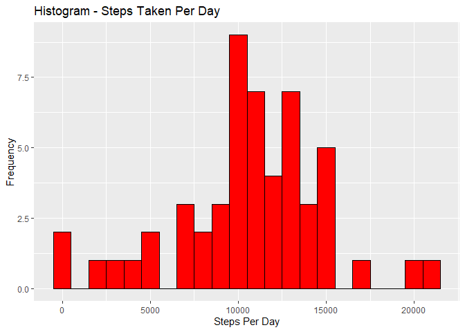
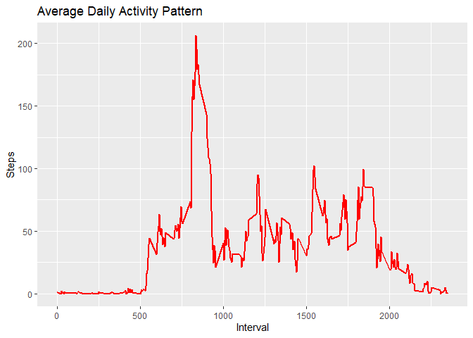
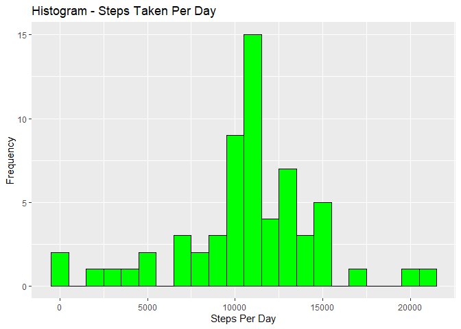
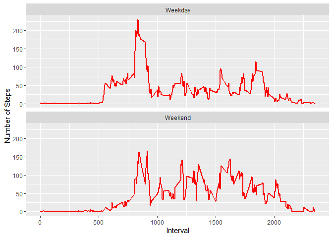

Report on Project #1
Introduction: 
A large amount of data about personal movement can now be collected using activity monitoring devices such as a Fitbit, Nike Fuelband, or Jawbone Up. These types of devices form part of the “quantified self” movement - a group of enthusiasts who take measurements about themselves regularly to improve their health, to find patterns in their behavior, or because they are tech geeks. But these data remain under-utilized both because the raw data are hard to obtain and there is a lack of statistical methods and software for processing and interpreting the data.
This assignment makes use of data from a personal activity monitoring device. This device collects data at 5 minutes intervals through out the day. The data consists of two months of data from an anonymous individual collected during the months of October and November, 2012 and include the number of steps taken in 5 minutes intervals each day.
The assignment requires two things: some data analysis and a written report using R markdown and a knitter.  It has multiple parts and needs to be completed in its entirety in a single R markdown document that can be processed by knitr and be transformed into an HTML file.  This report was written to answer all the questions detailed in the assignment.  It includes the codes that were used to generate the output presented.  
Submitting the assignment involves: 
(i)	Checking it into a GitHub repository, pushing my repository to GitHub and then submitting the URL for my repository.  
(ii)	Submitting the SHA-1 hash that indicates the specific commit that corresponds to the state of my repository, that identifies my submission.


Data

The data for this assignment was downloaded from the course web site:
https://d396qusza40orc.cloudfront.net/repdata%2Fdata%2Factivity.zip

The dataset is stored in a comma-separated-value (CSV) file and there are a total of 17,568 observations in this dataset. The variables included in this dataset are:

	steps: Number of steps taking in a 5-minute interval (missing values are coded as NA);
	date: The date on which the measurement was taken in YYYY-MM-DD format; and
	interval: Identifier for the 5-minute interval in which measurement was taken.


DATA ANALYSIS

## Loading and preprocessing the data
The required library was loaded using the codes:

```r
library(knitr)
```

```
## Warning: package 'knitr' was built under R version 4.3.1
```

```r
library(ggplot2)
```

```
## Warning: package 'ggplot2' was built under R version 4.3.1
```

```r
library(data.table)
library(gridExtra)
```

```
## Warning: package 'gridExtra' was built under R version 4.3.1
```

```r
opts_chunk$set(echo = TRUE, results = 'hold')
```

Next, the data was downloaded using the following code:

```r
download.file("https://d396qusza40orc.cloudfront.net/repdata/data/activity.zip", "activity.zip")
```

The data was unzipped; and the structure of the data frame, including the number of observations and variables, the data type and first few values of each variable were displayed using the following codes:

```r
activity <- unzip("activity.zip")
activity_data <- read.csv("activity.csv", header=TRUE, sep=",")
str(activity_data)
```

```
## 'data.frame':	17568 obs. of  3 variables:
##  $ steps   : int  NA NA NA NA NA NA NA NA NA NA ...
##  $ date    : chr  "2012-10-01" "2012-10-01" "2012-10-01" "2012-10-01" ...
##  $ interval: int  0 5 10 15 20 25 30 35 40 45 ...
```

Next the data was processed by converting the date and interval into a format suitable for the required analysis using the following codes:

```r
activity_data$date <- as.Date(activity_data$date, format="%Y-%m-%d")
activity_data$interval <- as.factor(activity_data$interval)
```
View the structure of the new data:

```r
str(activity_data)
```

```
## 'data.frame':	17568 obs. of  3 variables:
##  $ steps   : int  NA NA NA NA NA NA NA NA NA NA ...
##  $ date    : Date, format: "2012-10-01" "2012-10-01" ...
##  $ interval: Factor w/ 288 levels "0","5","10","15",..: 1 2 3 4 5 6 7 8 9 10 ...
```
Display the first 10 rows of the data to preview data

```r
head(activity_data, 10)
```

```
##    steps       date interval
## 1     NA 2012-10-01        0
## 2     NA 2012-10-01        5
## 3     NA 2012-10-01       10
## 4     NA 2012-10-01       15
## 5     NA 2012-10-01       20
## 6     NA 2012-10-01       25
## 7     NA 2012-10-01       30
## 8     NA 2012-10-01       35
## 9     NA 2012-10-01       40
## 10    NA 2012-10-01       45
```

## What is mean total number of steps taken per day?
1. Calculate the total number of steps taken per day

```r
steps_per_day <- aggregate(steps ~ date, data=activity_data, FUN=sum)
colnames(steps_per_day) <- c("date", "steps")
```

Preview the first 10 rows of the data frame of steps aggregated per day

```r
head(steps_per_day, 10)
```

```
##          date steps
## 1  2012-10-02   126
## 2  2012-10-03 11352
## 3  2012-10-04 12116
## 4  2012-10-05 13294
## 5  2012-10-06 15420
## 6  2012-10-07 11015
## 7  2012-10-09 12811
## 8  2012-10-10  9900
## 9  2012-10-11 10304
## 10 2012-10-12 17382
```

2. Make a histogram of the total number of steps taken each day

```r
ggplot(steps_per_day, aes(x = steps)) + 
  geom_histogram(fill = "red", binwidth = 1000, color = "black") + 
  labs(title = "Histogram - Steps Taken Per Day", x = "Steps Per Day", y = "Frequency")
```

<!-- -->

3. Calculate and report the mean and median of the total number of steps taken per day:

```r
mean_steps_per_day <- mean(steps_per_day$steps)
mean_steps_per_day
median_steps_per_day <- median(steps_per_day$steps)
median_steps_per_day
```

```
## [1] 10766.19
## [1] 10765
```

## What is the average daily activity pattern?
Average daily activity pattern:-
1. Make a time series plot (i.e. type = “l”) of the 5-minute interval (x-axis) and the average 
    number of steps taken, averaged across all days (y-axis).  The following codes are used:

```r
steps_per_interval <- aggregate(steps ~ interval, data = activity_data, FUN = mean, na.rm = TRUE)
steps_per_interval$interval <- as.integer(levels(steps_per_interval$interval)[steps_per_interval$interval])
colnames(steps_per_interval) <- c("interval", "steps")
```

Display data, the first 10 rows of the data frame with steps aggregated per interval:

```r
head(steps_per_interval, 10)
```

```
##    interval     steps
## 1         0 1.7169811
## 2         5 0.3396226
## 3        10 0.1320755
## 4        15 0.1509434
## 5        20 0.0754717
## 6        25 2.0943396
## 7        30 0.5283019
## 8        35 0.8679245
## 9        40 0.0000000
## 10       45 1.4716981
```

Make a timeseries plot of the 5-minute interval (x-axis) and the average number of steps taken,
averaged across all days (y-axis) using the following codes:

```r
ggplot(steps_per_interval, aes(x = interval, y = steps)) + geom_line(col = "red", size = 1) + 
  labs(title = "Average Daily Activity Pattern", x = "Interval", y = "Steps")
```

```
## Warning: Using `size` aesthetic for lines was deprecated in ggplot2 3.4.0.
## ℹ Please use `linewidth` instead.
## This warning is displayed once every 8 hours.
## Call `lifecycle::last_lifecycle_warnings()` to see where this warning was
## generated.
```

<!-- -->

2. Which 5-minute interval, on average across all the days in the dataset, contains the maximum number of steps?  This is calculated using the code below:

```r
max_interval <- steps_per_interval[which.max(steps_per_interval$steps),]
max_interval
```

```
##     interval    steps
## 104      835 206.1698
```

## Imputing missing values
1. Calculate and report the total number of missing values in the dataset (i.e. the total number of
    rows with NAs).  This was calculated using the following code:

```r
missing_values <- sum(is.na(activity_data$steps))
missing_values
```

```
## [1] 2304
```

2. Devise a strategy for filling in all of the missing values in the dataset. The strategy does not 
    need to be sophisticated. For example, you could use the mean/median for that day, or the 
    mean for that 5-minute interval, etc.

   In order to populate the missing values, they were replaced with the mean value at the same 
   interval across days.


3. Create a new dataset that is equal to the original dataset but with the missing data replaced
    with the mean value at the same interval across days.  The following code was used:

```r
new_activity_data <- activity_data
index_of_na <- which(is.na(new_activity_data$steps))
for (i in index_of_na) {
  new_activity_data$steps[i] <- with(steps_per_interval, steps[interval = new_activity_data$interval[i]])
}
```

Print the top rows of newly created dataset

```r
head(new_activity_data, 10)
```

```
##        steps       date interval
## 1  1.7169811 2012-10-01        0
## 2  0.3396226 2012-10-01        5
## 3  0.1320755 2012-10-01       10
## 4  0.1509434 2012-10-01       15
## 5  0.0754717 2012-10-01       20
## 6  2.0943396 2012-10-01       25
## 7  0.5283019 2012-10-01       30
## 8  0.8679245 2012-10-01       35
## 9  0.0000000 2012-10-01       40
## 10 1.4716981 2012-10-01       45
```

Since there are no missing values anymore, verify that the above strategy really worked by using the following code:

```r
new_missing_values <- sum(is.na(new_activity_data$steps))
new_missing_values
```

```
## [1] 0
```
4. Make a histogram of the total number of steps taken each day and calculate and report the 
    mean and median total number of steps taken per day. Do these values differ from the 
    estimates from the first part of the assignment? What is the impact of imputing missing 
    data on the estimates of the total daily number of steps?

Make the histogram using the following code:

```r
new_steps_per_day <- aggregate(steps ~ date, data = new_activity_data, FUN=sum)
colnames(new_steps_per_day) <- c("date", "steps")
ggplot(new_steps_per_day, aes(x = steps)) + 
  geom_histogram(fill = "green", binwidth = 1000, color = "black") + 
  labs(title = "Histogram - Steps Taken Per Day", x = "Steps Per Day", y = "Frequency")
```

<!-- -->


Find the impact of imputing the missing values by computing the mean and median of steps taken per day using the following code:

```r
new_mean_steps_per_day <- mean(new_steps_per_day$steps)
new_mean_steps_per_day
new_median_steps_per_day <- median(new_steps_per_day$steps)
new_median_steps_per_day
```

```
## [1] 10766.19
## [1] 10766.19
```

It should be noted that both the mean and median of steps taken per day are exactly same; this 
was not the case prior to imputing missing values.

## Are there differences in activity patterns between weekdays and weekends?
1. First, create a new factor variable in the dataset with two levels - “weekday” and “weekend”
    and indicate whether a given date is a weekday or weekend day.

Add a factor variable to identify the given date as Weekday or Weekend by using the code below:

```r
dt <- data.table(new_activity_data)
dt[, weekday := ifelse(weekdays(date) %in% c("Saturday", "Sunday"), "Weekend", "Weekday")]
dt$weekday <- as.factor(dt$weekday)
dt$interval <- as.integer(levels(dt$interval)[dt$interval])
head(dt, 10)
```

```
##         steps       date interval weekday
##  1: 1.7169811 2012-10-01        0 Weekday
##  2: 0.3396226 2012-10-01        5 Weekday
##  3: 0.1320755 2012-10-01       10 Weekday
##  4: 0.1509434 2012-10-01       15 Weekday
##  5: 0.0754717 2012-10-01       20 Weekday
##  6: 2.0943396 2012-10-01       25 Weekday
##  7: 0.5283019 2012-10-01       30 Weekday
##  8: 0.8679245 2012-10-01       35 Weekday
##  9: 0.0000000 2012-10-01       40 Weekday
## 10: 1.4716981 2012-10-01       45 Weekday
```


2. Make a panel plot containing a time series plot (i.e. type = “l”) of the 5-minute interval 
    (x-axis) and the average number of steps taken, averaged across all weekday days or 
    weekend days (y-axis) using the code below:


```r
steps_per_weekday <- aggregate(steps ~ interval+weekday, data = dt, FUN = mean)
ggplot(steps_per_weekday, aes(x = interval, y = steps)) + 
  geom_line(col = "red", size = 1) + 
  facet_wrap(~ weekday, nrow=2, ncol=1) + 
  labs(x = "Interval", y = "Number of Steps")
```

<!-- -->

